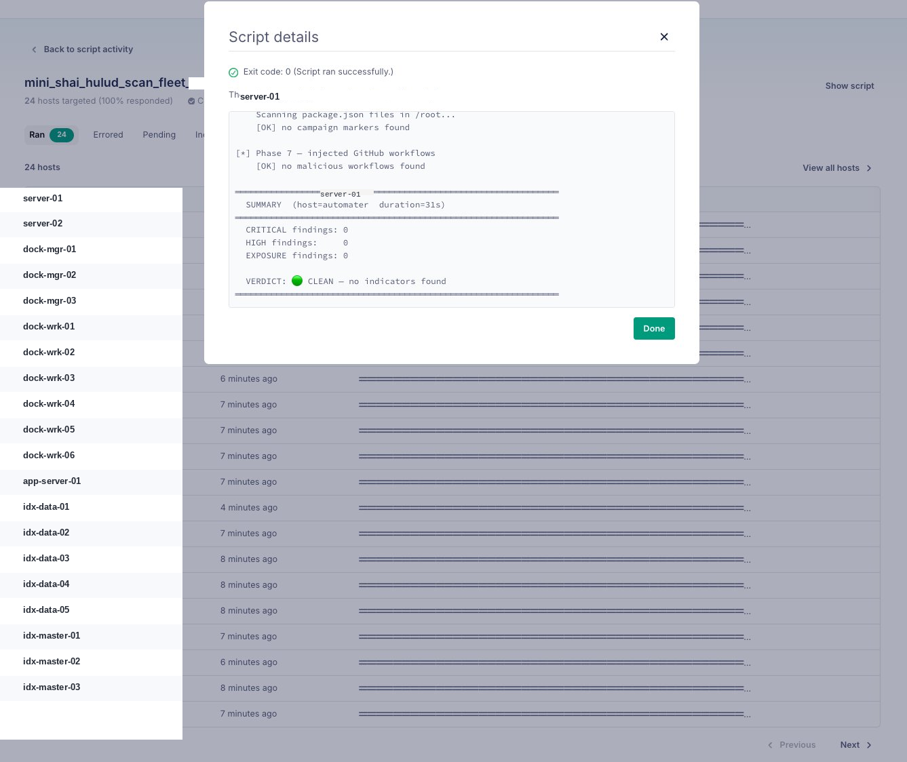
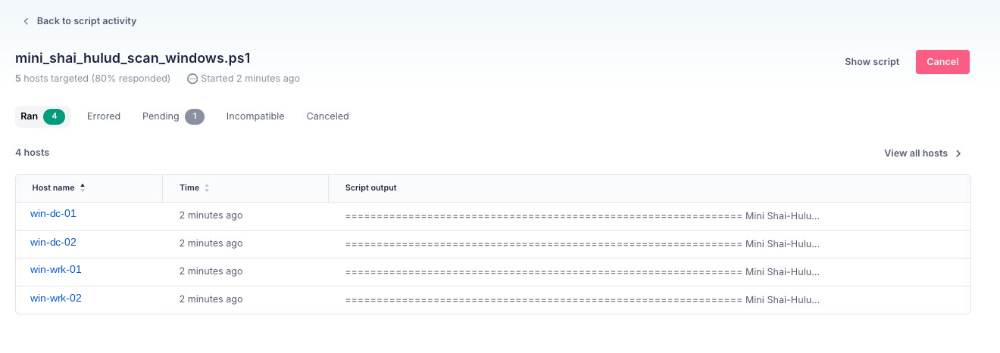

> **CVE-2026-45321 / GHSA-g7cv-rxg3-hmpx.** Active since May 11, 2026. **42 TanStack packages (84 versions) directly compromised**, plus the broader Mini Shai-Hulud campaign affecting 175 packages across 17 namespaces. Daemonizes silently on `npm install`. Harvests GitHub Actions OIDC, AWS, Vault, and Kubernetes credentials. Propagates autonomously. **If you run JavaScript anywhere near a developer machine: stop and read this.**

| | |
|---|---|
| **CVE** | CVE-2026-45321 / GHSA-g7cv-rxg3-hmpx |
| **Campaign** | Mini Shai-Hulud |
| **Status** | Active (May 11, 2026) |
| **TanStack scope** | 42 packages · 84 versions · 12M+ weekly downloads |
| **Broader campaign** | 175 packages · 406 versions · 17 namespaces |
| **Primary targets** | Developer machines, CI/CD runners, cloud workloads |

---

## What happened

An orphaned commit in the TanStack/router repository was used to hijack the repository's CI workflow OIDC token. With that token, the attacker bypassed 2FA and npm publishing protections, pushing a malicious payload — `router_init.js` (2.3 MB) — into affected package versions as a post-install hook.

The infection chain once a developer runs `npm install`:

1. `router_init.js` executes via `postInstall` hook
2. Daemonizes: detaches from the terminal, nothing looks wrong, install appears to complete normally
3. Harvests credentials in order: GitHub Actions OIDC tokens, AWS via IMDSv2/Secrets Manager/SSM across all regions, HashiCorp Vault, Kubernetes service account tokens
4. Propagates: uses the stolen OIDC token to republish a new malicious version to npm under the legitimate maintainer identity
5. Persists: writes hooks to `.claude/` and `.vscode/` directories
6. Exfiltrates: over Session's decentralized P2P network (`filev2.getsession[.]org`)
7. Commits to compromised repositories via GitHub GraphQL API, spoofing `claude@users.noreply.github.com` as the author

The campaign name — Mini Shai-Hulud — is a Dune reference. A small sandworm that eats everything in its path.

---

## Why this is different from most supply chain attacks

**It daemonizes.** Most malicious post-install scripts do their damage synchronously and leave a trace in terminal output. This one forks, detaches, and returns control to the terminal immediately. The install looks clean.

**Sigstore attestations are worthless here.** The malware generates valid provenance attestations because it publishes through a legitimate maintainer's OIDC token. The package has a valid signature. Verifying signatures tells you nothing.

**It propagates via OIDC, not stolen passwords.** If any CI runner in a compromised developer's environment runs with a GitHub Actions OIDC token that has npm publish permissions, the worm can republish under that identity. Two-factor authentication doesn't protect against this — the token is already issued.

**The C2 is P2P.** Exfiltration goes over Session's decentralized network. There's no single IP to block, no traditional C2 domain that resolves to a known bad actor. DNS blocking `filev2.getsession[.]org` is necessary but note that Session is a real messaging application — you may have legitimate traffic to this domain.

**It targets `.claude/` directories.** The worm specifically writes persistence hooks to `~/.claude/` — the configuration directory used by Claude Code. It also targets `.vscode/`. This is a deliberate choice: developer tooling is where credentials live, and developer machines have access to production environments.

**Campaign markers are embedded for tracking.** Malicious `package.json` files contain a unique PBKDF2 salt (`svksjrhjkcejg`) and the string `IfYouRevokeThisTokenItWillWipeTheComputerOfTheOwner`. This is both a tracking marker and a threat.

---

## Detection approach with Fleet

We ran this across 30 hosts in two passes:

1. **Fleet live queries** (osquery SQL) — fast fleet-wide sweep for known-bad package versions, persistence files, active processes, and C2 connections. Results in seconds.
2. **Deep scan scripts** deployed via Fleet run-script — comprehensive per-host filesystem scan that the SQL queries cannot cover. Results in ~30 seconds per host.

Both layers are necessary. Here's why.

---

## Critical caveat: what Fleet's npm table misses

> Fleet's `npm_packages` osquery table queries **globally installed** packages only — the paths osquery's walker discovers by default: `~/.npm-global`, `/usr/local/lib/node_modules`, `/opt/homebrew/lib/node_modules`. **It does not scan project-local `node_modules/` directories.**

In practice, almost all developer npm installs are local — `npm install` without `-g` drops packages into a `node_modules/` folder inside the project directory. A developer with 20 active projects could have a compromised `@tanstack/react-router@1.169.8` installed in `~/code/my-app/node_modules/` and Fleet's `npm_packages` query returns zero rows for it.

The SQL queries are the right first pass: fast, fleet-wide, catches global/NVM installs and anyone who ran `npm install -g` with a bad version. But to find per-project exposure, you need the scripts.

The deep scan scripts fix this by running `find ... -maxdepth 10 -type d -name node_modules` recursively across every user's home directory, then checking each discovered `node_modules/` tree against the full compromised version list. This is the only reliable way to catch local installs.

**Short version: SQL queries = global exposure check. Scripts = the complete picture.**

---

## The detection tooling

### Fleet SQL queries

Three SQL files for Linux, macOS, and Windows. Each query is a `UNION ALL` across multiple indicator classes and returns a tagged result set:

```sql
-- Each result row is tagged by severity class:
-- EXPOSURE_global_pkg_version  — compromised version in global npm tree
-- CRITICAL_persistence_*       — systemd service / LaunchAgent / payload file present
-- CRITICAL_active_payload_*    — malware process currently running
-- HIGH_persistence_editor_hook — .claude/ or .vscode/ hooks present
```

The coverage:
- **42 TanStack packages (84 versions)** directly compromised
- **133 additional packages (322 versions)** from the broader Mini Shai-Hulud campaign — these share the same payload SHA256s, C2 domains, and campaign markers, so the same IoC set detects them
- `@tanstack/setup` is the forged package — **never legitimate at any version**, flag any installation immediately
- Payload file paths across all common install locations including NVM
- Active process check (`router_init.js`, `router_runtime.js`, `tanstack_runner.js` in cmdline)
- Systemd user service (`gh-token-monitor.service`) and macOS LaunchAgent (`com.user.gh-token-monitor.plist`)
- Editor hooks in `.claude/` and `.vscode/`

### Deep scan scripts (7-phase)

`mini_shai_hulud_scan_fleet_deep.sh` (Linux/macOS) and `mini_shai_hulud_scan_windows.ps1` (Windows).

Each script runs through seven phases in sequence, with a 300-second timeout:

| Phase | What it checks |
|---|---|
| 1 — System persistence | systemd user services, LaunchAgents |
| 2 — Payload files | `router_init.js` and `tanstack_runner.js` by SHA256, across all home directories and global npm paths |
| 3 — Editor hooks | `.claude/router_runtime.js`, `.claude/setup.mjs`, `.vscode/setup.mjs` |
| 4 — Local npm packages | **All `node_modules/` directories recursively** — this is the layer the SQL queries miss |
| 5 — Git dead-drop commits | `claude@users.noreply.github.com` spoofed author, `voicproducoes` compromised account, specific malicious commit hash |
| 6 — Campaign markers | PBKDF2 salt `svksjrhjkcejg`, campaign string in `package.json`, malicious commit reference |
| 7 — Workflow injection | `.github/workflows/*.yml` scanning for `toJSON(secrets)`, C2 domains, `__DAEMONIZED`, `router_init` |

Exit codes are explicit:

| Code | Verdict | Meaning |
|---:|---|---|
| 0 | 🟢 CLEAN | No indicators found |
| 1 | 🟡 EXPOSED | Compromised package version installed, no execution evidence |
| 2 | 🟠 HIGH | Editor-hook persistence found |
| 3 | 🔴 CRITICAL | Payload file or system persistence — likely compromised |

---

## What the scans found

**Linux/macOS — 24 hosts (100% responded):**



All 24 Linux hosts returned exit 0 — CLEAN. Sample output from one host:

```
[*] Phase 6 — campaign markers in package.json
    Scanning package.json files in /root...
    [OK] no campaign markers found

[*] Phase 7 — injected GitHub workflows
    [OK] no malicious workflows found

═══════════════════════════════════════════════════════════════
  SUMMARY  (host=automater  duration=31s)
═══════════════════════════════════════════════════════════════
  CRITICAL findings: 0
  HIGH findings:     0
  EXPOSURE findings: 0

  VERDICT: 🟢 CLEAN — no indicators found
```

**Windows — 5 hosts targeted (80% responded, 1 pending):**



4 Windows hosts ran and returned output. DC01, DC02, WIN10-1, and WRK-AI all completed. One host pending at time of screenshot.

---

## IoC quick reference

### Primary indicators — check these first

| Indicator | Value / Pattern |
|---|---|
| Malware file | `router_init.js` (SHA256: `ab4fcadaec...601266c`) |
| Runner file | `tanstack_runner.js` (SHA256: `2ec78d5...e27fc96`) |
| Forged package | `@tanstack/setup` — any version is malicious |
| Active process | `node` process with `router_init.js` in cmdline |
| C2 egress | `filev2.getsession[.]org`, `api.masscan.cloud` |
| Spoofed author | `claude@users.noreply.github.com` |

### Persistence locations

| Platform | Path |
|---|---|
| Linux | `~/.config/systemd/user/gh-token-monitor.service` |
| Linux | `~/.local/bin/gh-token-monitor.sh` |
| macOS | `~/Library/LaunchAgents/com.user.gh-token-monitor.plist` |
| All | `~/.claude/router_runtime.js`, `~/.claude/setup.mjs` |
| All | `~/.vscode/setup.mjs` |

### Key compromised package versions (most impactful)

| Package | Bad versions |
|---|---|
| `@tanstack/react-router` | 1.169.5, 1.169.8 |
| `@tanstack/router-core` | 1.169.5, 1.169.8 |
| `@tanstack/react-start` | 1.167.68, 1.167.71 |
| `@tanstack/router-plugin` | 1.167.38, 1.167.41 |
| `@mistralai/mistralai` | 2.2.2, 2.2.3, 2.2.4 |
| `@opensearch-project/opensearch` | 3.5.3, 3.6.2, 3.7.0, 3.8.0 |

42 TanStack packages directly compromised; the SQL queries also cover the 175-package broader Mini Shai-Hulud campaign since IoCs are shared.

---

## Immediate actions

### Priority 1 — do this now (< 15 min)

1. **Block DNS egress** to `filev2.getsession[.]org` and `api.masscan.cloud` at your DNS resolver and firewall. Do this before anything else — cuts exfiltration.
2. **Deploy the SQL queries** as Fleet live queries against all endpoints.
3. **Any host returning CRITICAL** (exit code 3, or active process): isolate immediately, then rotate credentials in this order — npm tokens first, GitHub PATs, then AWS/Vault/K8s.

### Priority 2 — within 1 hour

4. **Deploy the deep scan scripts** via Fleet run-script. The SQL queries check global packages; the scripts check every `node_modules/` directory on disk. You need both.
5. **Audit git history** in any repository for commits from `claude@users.noreply.github.com` or `voicproducoes`.
6. **Check CI/CD workflow files** for `toJSON(secrets)`, `getsession.org`, or `router_init`.

### Priority 3 — within 24 hours

7. **Proactive credential rotation** on any machine where an affected package was installed in the last 7 days, even if the scan is clean. The malware may have already exfiltrated and cleaned up.
8. **Audit npm publish logs** for unexpected publishes from your organization's packages.
9. **Pin GitHub Actions references** to commit SHAs.

---

## Key lessons

**Sigstore provenance doesn't protect you from OIDC token theft.** The attacker had a legitimately-issued OIDC token; the signature was valid. Provenance attestations are meaningful for supply chain attribution, not for detecting credential compromise.

**Post-install hooks are still the attack surface.** `postInstall` scripts execute with the same privileges as the user running `npm install`. On developer machines and CI runners, that's often too much.

**Developer tooling directories are high-value targets.** The choice to persist in `.claude/` specifically shows that attackers track which tools developers use. Directory-based persistence in editor/AI tooling survives across project changes and reboots.

**Scan local `node_modules/`, not just global.** Fleet's `npm_packages` table is a fast first pass but covers global installs only. Any environment where developers do per-project installs requires a filesystem-level scan to get the full picture.

**Rotate first, investigate second.** If any affected package version was installed in the last 7 days, assume credentials were harvested and rotate them before spending time on forensics. The window between install and exfiltration is measured in seconds, not minutes.

---

## Resources

| Resource | Link |
|---|---|
| Socket.dev blog | https://socket.dev/blog/tanstack-npm-packages-compromised-mini-shai-hulud-supply-chain-attack |
| TanStack postmortem | https://tanstack.com/blog/npm-supply-chain-compromise-postmortem |
| Mini Shai-Hulud campaign page | https://socket.dev/supply-chain-attacks/mini-shai-hulud |
| Linux/macOS Fleet SQL | [`/code/tanstack-linux-queries.sql`](/dirtyfrag-blog/code/tanstack-linux-queries.sql) |
| macOS Fleet SQL | [`/code/tanstack-macos-queries.sql`](/dirtyfrag-blog/code/tanstack-macos-queries.sql) |
| Windows Fleet SQL | [`/code/tanstack-windows-queries.sql`](/dirtyfrag-blog/code/tanstack-windows-queries.sql) |
| Linux/macOS deep scan script | [`/code/mini_shai_hulud_scan_fleet_deep.sh`](/dirtyfrag-blog/code/mini_shai_hulud_scan_fleet_deep.sh) |
| Windows deep scan script | [`/code/mini_shai_hulud_scan_windows.ps1`](/dirtyfrag-blog/code/mini_shai_hulud_scan_windows.ps1) |

---

